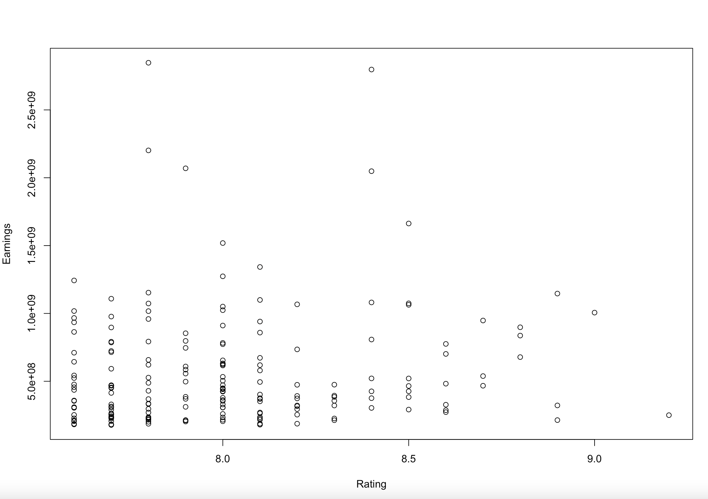
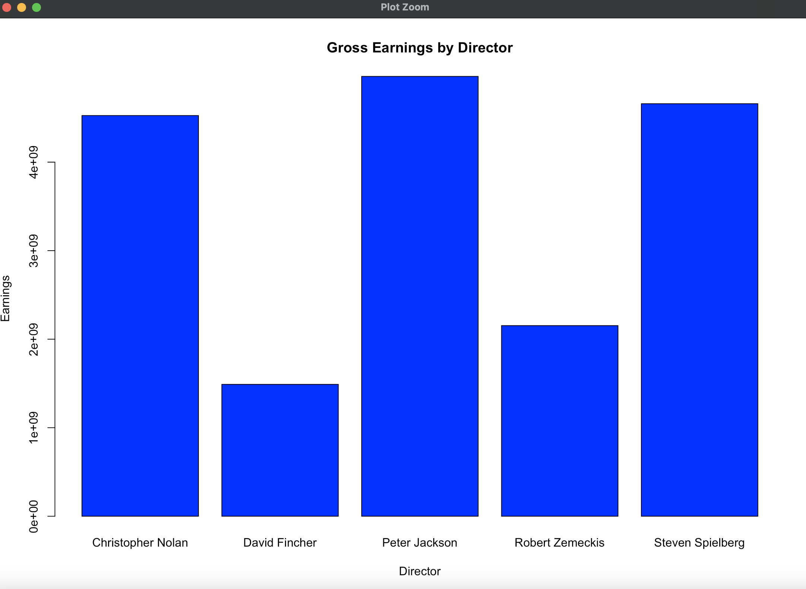
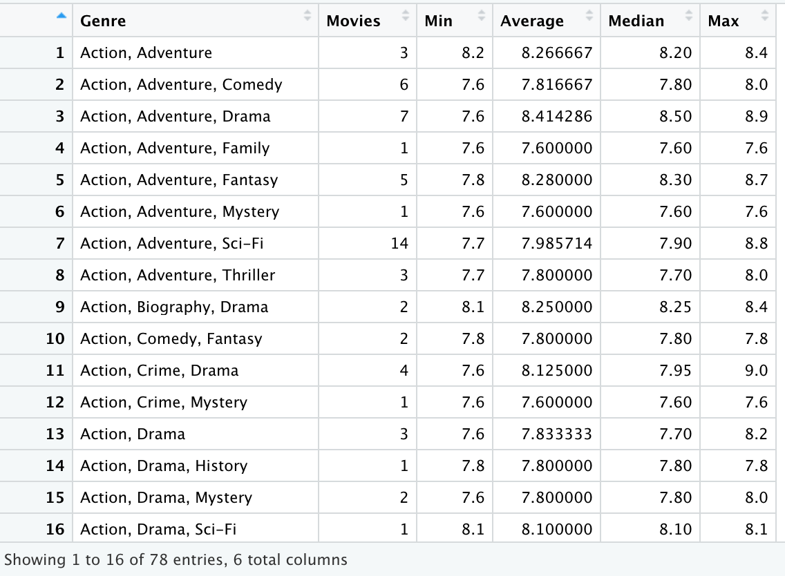

# Data Wrangling Final Project
> The purpose of this project was to display my expertise in RStudio. My group and I wanted to analyze how Movie ratings correlated with earnings overtime. Throughout this project we look at multiple different aspects that dive into that relationship. 

## Table of Contents
* [General Info](#general-information)
* [Research Questions](#research-questions)
* [Technologies Used](#technologies-used)
* [Features](#features)
* [Screenshots](#screenshots)
* [Setup](#Setup)
* [Project Status](#project-status)
* [Room for Improvement](#room-for-improvement)
* [Acknowledgements](#acknowledgements)
* [Contact](#contact)

## General Information
- Data from kaggle and box office mojo
- This final project concluded the Data Wrangling course at the University of Iowa

## Research Questions
- What is the distribution of movies and ratings across different genres? 
- Is there any relationship between IMDb ratings and worldwide gross earnings?
- Is there a relationship between the Director’s that have produced multiple films and the gross earnings for their films? 

## Technologies Used
- RStudio - version 4.1
- Github Desktop

## Features
- Correlation graph of Ratings vs Earnings
- Bar Chart of top 5 earning directors
- Merged dataset with earning and rating fields

## Screenshots

## Setup
To correctly run this project one should have the latest version of RStudio downloaded. Once complete, download the 'Final Project.R' script and the 'imdb_top_1000.csv' to your local desktop. Set the working directory to your desktop in RStudio and begin running the code within the R script. 

## Project Status
Project is: _complete_
> This was the final project in the Data Wrangling class; therefore, I have not revisited this project since December 2021 and it's considered complete. 

## Room for Improvement
- Look at the impact the pandemic had on earnings in the film industry
- How have streaming services such as Netflix and Hulu impacted movie earnings?
- Look at all movies overtime. This project analyzes only 193 films that were found in both datasets. 

## Acknowledgements
- This project was inspired by Professor Mike Colbert in his Data Wrangling class at the University of Iowa. 
- My group members Caleb Kitzman, Blake Murray, Blake Johnson, and Asher Titus collaborated on this project together. 
- Data from this project was scraped from [Box Office Mojo](https://www.boxofficemojo.com/chart/ww_top_lifetime_gross/?ref_=bo_lnav_hm_shrt) and downloaded from [kaggle](https://www.kaggle.com/harshitshankhdhar/imdb-dataset-of-top-1000-movies-and-tv-shows).

## Contact
Created by [@GrantTruesdale](https://www.linkedin.com/in/grant-truesdale-330612154/) - feel free to connect with me!
